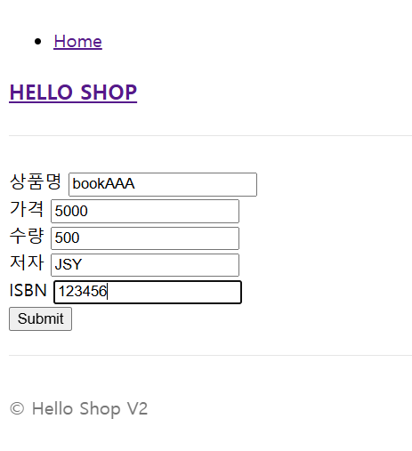
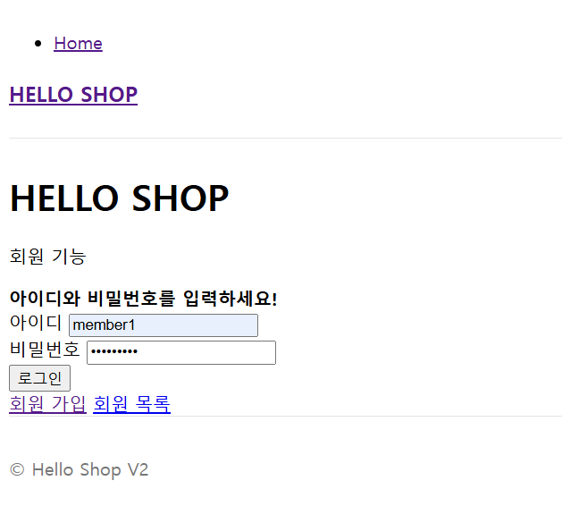
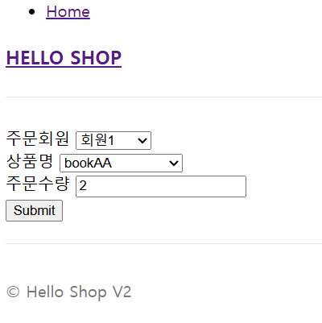
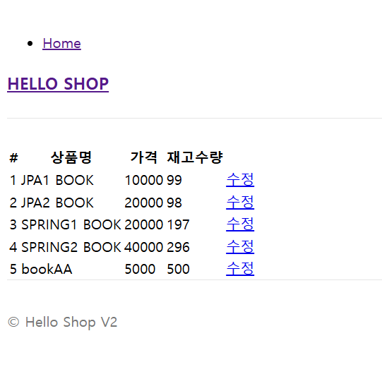

# Spring JPA Project – 로그인, 상품 주문 및 등록 웹 애플리케이션
spring+jpa project to order and sell various items







## 1. 프로젝트 개요
이 프로젝트는 Spring Security를 적용하여 사용자 로그인 및 회원가입, 상품 주문과 등록 기능을 제공하는 전자상거래 웹 애플리케이션입니다.  
주요 기능으로는 사용자 인증, 상품 목록 조회, 주문 프로세스, 관리자에 의한 상품 등록/수정/삭제가 포함되어 있습니다.

## 2. 기술 스택 및 참고 자료
- **Backend Framework**: Spring Boot (3.4.1 이상)
- **보안**: Spring Security
- **데이터 처리**: Spring Data JPA
- **템플릿 엔진**: Thymeleaf
- **데이터베이스**:  MySQL
- **빌드 도구**: Gradle
- **보조 라이브러리**: Lombok ...
- **참고 자료**:
    - [Spring 공식 문서](https://spring.io/projects/spring-boot)
    - [Spring Security 가이드](https://spring.io/guides/topicals/spring-security-architecture)
    - [JPA 튜토리얼](https://www.baeldung.com/the-persistence-layer-with-spring-data-jpa)

## 3. 설치 및 실행 방법

### 3.1. 프로젝트 클론
```bash
git clone https://github.com/username/spring-jpa-project.git
cd spring-jpa-project
```
http://localhost:8080
이 프로젝트는 MIT 라이선스 하에 배포됩니다.